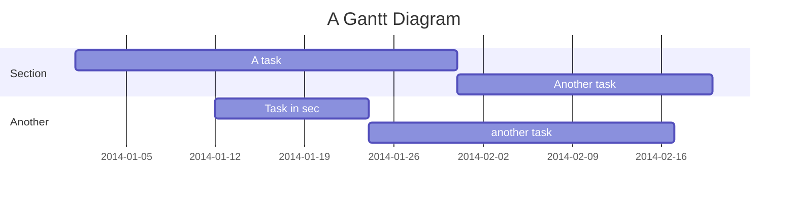
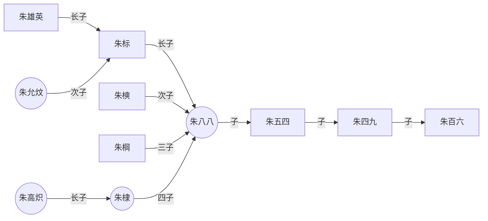
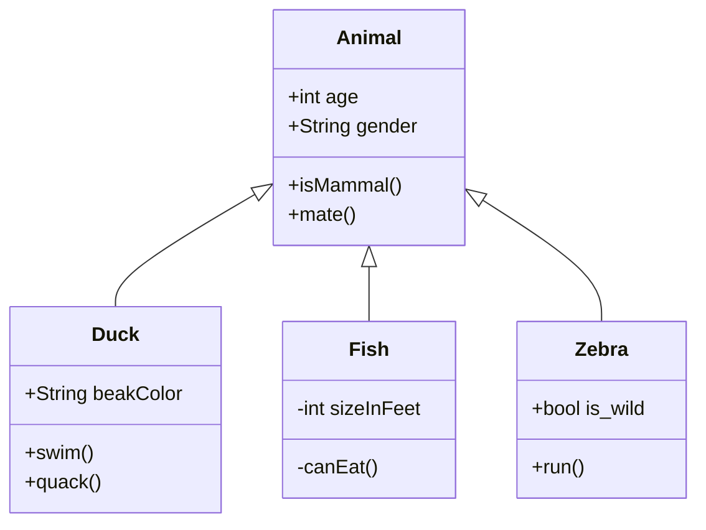

# 一、标题和正文

使用 `#` 表示标题，其中 `#` 号必须在行首，例如：

# 一号标题

## 二号标题

### 三号标题

#### 四号标题

#### 五号标题

###### 六号标题

# 4

使用 `===` 或者 `---` 表示，例如：

# 一级标题

## 二级标题

测试

### 谷歌

正文字体

1、改变字体
在 Markdown 语法中，使用 `<font>` 标签的 `face` 属性修改文字字体。字体在不同环境中支持程度不同，表现结果可能也不同。

```markdown
<font face="HEI">这里是黑体</font>

<font face="KAI">这里是楷体</font>

<font face="GB18030 Bitmap">这里是扩展字体</font>
```

<font face="华文宋体">这里是黑体</font>
<font face="楷体">这里是楷体</font>
<font face="GB18030 Bitmap">这里是扩展字体</font>

## 2、修改字号

<font face='楷体' size='5'>Markdown 有三种主要方式</font>
第一种是使用 `<font>` 标签；
第二种通过 `<big>` 或者 `<small>` 标签
第三种是通过修改 `style` 样式实现。

使用 `<font>` 标签 `size` 属性修改局部字号

```markdown
<font size="1">1号字 最小</font>

<font size="2">2号字</font>

<font size="3">3号字 默认</font>

<font size="4">4号字</font>

<font size="5">5号字</font>

<font size="6">6号字</font>

<font size="7">7号字 最大</font>
```

<font size="1">1号字 最小</font>

<font size="2">2号字</font>

<font size="3">3号字 默认</font>

<font size="4">4号字</font>

<font size="5">5号字</font>

<font size="6">6号字</font>

<font size="7">7号字 最大</font>

3、字体颜色
<font face='楷体' size='3' color='blue'>在 Markdown 语法中，使用 `font` 标签的 `color` 属性修改文字颜色。</font>

```markdown
<font color="red">红色</font>
<font color="green">绿色</font>
<font color="blue">蓝色</font>
<font color="rgb(200, 100, 100)">使用 rgb 颜色值</font>
<font color="#FF00BB">使用十六进制颜色值</font>
```

<font color="red">红色</font>
<font color="green">绿色</font>
<font color="blue">蓝色</font>
<font color="rgb(200, 100, 100)">使用 rgb 颜色值</font>
<font color="#FF00BB">使用十六进制颜色值</font>

```markdown
<font style="background: linear-gradient( to right, #ff1616, #ff7716, #ffdc16, #36c945, #10a5ce, #0f0096, #a51eff, #ff1616);">这是七色光彩背景颜色</font>
```

<font style="background: linear-gradient( to right, #ff1616, #ff7716, #ffdc16, #36c945, #10a5ce, #0f0096, #a51eff, #ff1616);">这是七色光彩背景颜色</font>

# 二、分割线

分隔线是用一条明显的横线，来划分文章的上下两个部分，从而使排版变得美观

123

---

---

---

# 三、粗体斜体

**_使用 `_`和`**` 分别表示斜体和粗体，例如 \*\*\*

_斜体_
**粗体**
**_又斜又粗_**

~~我要删掉的文字~~

# 四、超链接和图片

Markdown 支持两种超链接的定义方式：`行内定义` 和 `全局声明`
都是由 「中括号 `[]`」来声明。

语法：`中括号[链接名称](目标链接)`

```markdown
Obsidan简单入门教程[哔哩哔哩](https://space.bilibili.com/507578555/?spm_id_from=333.999.0.0 "IOI")
```

Obsidan简单入门教程[哔哩哔哩](https://space.bilibili.com/507578555/?spm_id_from=333.999.0.0 "IOI")

在 Markdown 语法中，
语法：`")` 的形式定义图片

```markdown

```


![](https://image.baidu.com/search/detail?ct=503316480&z=0&ipn=d&word=%E9%A9%AC%E5%8D%9A%E5%B3%B0&step_word=&hs=0&pn=0&spn=0&di=7108135681980891137&pi=0&rn=1&tn=baiduimagedetail&is=0%2C0&istype=0&ie=utf-8&oe=utf-8&in=&cl=2&lm=-1&st=undefined&cs=1637495421%2C647503309&os=1482974809%2C4155393326&simid=1637495421%2C647503309&adpicid=0&lpn=0&ln=450&fr=&fmq=1655308061627_R&fm=&ic=undefined&s=undefined&hd=undefined&latest=undefined&copyright=undefined&se=&sme=&tab=0&width=undefined&height=undefined&face=undefined&ist=&jit=&cg=&bdtype=15&oriquery=&objurl=https%3A%2F%2Fgimg2.baidu.com%2Fimage_search%2Fsrc%3Dhttp%3A%2F%2Fzhengxin-pub.cdn.bcebos.com%2Fmark%2F305f97293a328dcf971e1e684159c120.jpg%26refer%3Dhttp%3A%2F%2Fzhengxin-pub.cdn.bcebos.com%26app%3D2002%26size%3Df9999%2C10000%26q%3Da80%26n%3D0%26g%3D0n%26fmt%3Dauto%3Fsec%3D1657900066%26t%3D678054910d3c0a812fadecd69827c195&fromurl=ippr_z2C%24qAzdH3FAzdH3Fwtqtviw_z%26e3Bkwt17_z%26e3Bv54AzdH3F4w6hAzdH3Ff%3Fq%3D%25Cd%25ED%25Bd%25Al%25B0%25Ec&gsm=1&rpstart=0&rpnum=0&islist=&querylist=&nojc=undefined&dyTabStr=MCwzLDYsMSw0LDUsNyw4LDIsOQ%3D%3D)

# 五、有序和无需列表

**1、无序列表**

使用 `-`、`+` 和 `*` 表示无序列表，前后留一行空白，可嵌套，例如

```markdown
使用星号生成无序列表

- 项目1
  使用加号生成无序列表

* 项目2
  使用减号生成无序列表

- 项目3
```

使用星号生成无序列表

- 项目1
  使用加号生成无序列表

* 项目2
  使用减号生成无序列表

- 项目3

**2、无序列表的嵌套**

在 `-`、`+` 和 `*` 之前使用tab键将其缩进，每个tab表示一层。

```markdown
无序列表的嵌套

- 第一层 1
  - 第二层 1
    - 第三层 1
      - 第四层 1
        - 第五层 1
    - 第三层 2
  - 第二层 2
```

- 第一层 1
  - 第二层 1
    - 第三层 1
      - 第四层 1
        - 第五层 1
    - 第三层 2
  - 第二层 2

**3、有序列表**

通过「数字 + `.` 」的形式定义有序列表，有序列表在发布后会被转化为：

```markdown
### 有序列表

使用数字实现有序列表

1. 项目1
2. 项目2
3. 项目3

源码中的数字与渲染后的数字并不一一对应，但可以决定列表的开始序号
```

# 六、引用

使用 `>` 表示，可以有多个 `>`，表示层级更深，例如

> 第一层
>
> > 第二层
> > 这样是跳不出去的
> >
> > > 还可以更深

# 七、代码样式

1、行内代码

使用 「反引号 `` ` ``」符号定义行内代码。

`行内代码`

2、代码块

使用四个空格缩进表示代码块，例如

    public class HelloWorld
    {
        public static void main(String[] args)
        {
            System.out.println( "Hello, World!" );
        }
    }

# 八、表格

**Markdown 表格包含三个部分：表头、分割线、数据。**

- **表头** 用来对列名对象进行描述，也就是通常所说的列名；
- **数据** 用来展示每行的具体内容，数据是表格的核心；
- **分割线** 用来区分表头和数据，也是 Markdown 中表格定义的最基本语法要求。

**Markdown 表格由 「竖线 `|`」、「减号 `-`」、「冒号 `:`」三种符号组成。**

- **竖线** 用来定义列，每两个竖线之间为一个单元格元素；
- **减号** 用来定义分割线，也就是分割表头和数据体；
- **冒号** 配合减号使用，用于定义列数据的对齐属性。

| 商品         | 数量 |  单价  |
| ------------ | ---: | :----: |
|              |      |        |
| 苹果苹果苹果 |   10 |  \$1   |
| 电脑         |    1 | \$1999 |

# 九、数学公式

Markdown 中的数学公式支持支持 **LaTeX**，分为「行中公式」和「独立公式」两种。

行中公式用两个单独的「美元符 `$`」表示。

世界上最难的问题$1+1=2$，如何证明？

独立公式用两个连续的「美元符 `$$`」表示，换行通过 `\` 实现。

平均数符号：$overline{xyz}$  
开二次方符号：$sqrt x$  
开方符号：$sqrt[3]{x+y}$  
对数符号：$log(x)$  
极限符号：$lim^{x to infty}_{y to 0}{frac{x}{y}}$  
极限符号：$displaystyle lim^{x to infty}_{y to 0}{frac{x}{y}}$  
求和符号：$sum^{x to infty}_{y to 0}{frac{x}{y}}$  
求和符号：$displaystyle sum^{x to infty}_{y to 0}{frac{x}{y}}$  
积分符号：$int^{infty}_{0}{xdx}$  
积分符号：$displaystyle int^{infty}_{0}{xdx}$

# 十、任务列表

在 Markdown 文件中，在 ” 无序列表 `-,+,*` ” 后面使用 `「中括号 []」` 声明复选框。在中括号中写入 `x` ，便可实现选中效果。

- [ ] Java
- [x] Php

# 十一、标签

#标签
#dark

# 十二、绘图






